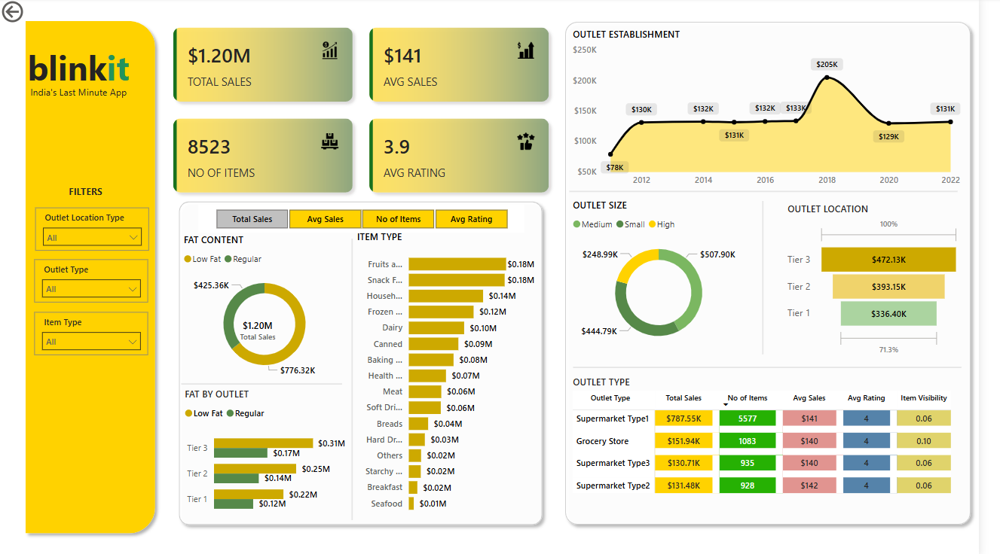

# 🛒 Blinkit Sales Analysis – Power BI Project

## 📸 Dashboard Preview

This Power BI project provides a comprehensive analytical overview of Blinkit's sales performance, customer satisfaction, and inventory distribution. The dashboard delivers critical insights for optimizing sales strategy, outlet performance, and customer experience.

---

## 🧩 Business Objective

To conduct a **data-driven performance analysis** for Blinkit, focused on:
- Tracking sales trends across product categories, outlet types, and locations
- Understanding how factors like fat content, outlet size, and item type impact KPIs
- Visualizing customer satisfaction using average rating metrics
- Enabling stakeholders to make informed decisions through interactive dashboards

---

## 📌 KPIs Tracked

- **Total Sales** – Total revenue generated from item sales
- **Average Sales** – Revenue per sale across items
- **Number of Items** – Total quantity of unique items sold
- **Average Rating** – Mean customer rating for products

---

## 📊 Visualizations

| Title                                 | Chart Type         | Purpose                                                                 |
|--------------------------------------|--------------------|-------------------------------------------------------------------------|
| **Total Sales by Fat Content**       | Donut Chart        | Analyze impact of Low Fat vs Regular Fat items on revenue               |
| **Total Sales by Item Type**         | Bar Chart          | Compare item category performance across sales and ratings              |
| **Fat Content by Outlet**            | Stacked Column     | Compare outlet-wise sales distribution segmented by fat content         |
| **Total Sales by Outlet Establishment** | Line Chart       | Track annual trends in sales based on outlet establishment type         |
| **Sales by Outlet Size**             | Donut Chart        | Analyze how outlet size correlates with total revenue                   |
| **Sales by Outlet Location**         | Bar Chart          | Evaluate sales across Tier 1, Tier 2, and Tier 3 locations              |
| **All Metrics by Outlet Type**       | Matrix Card        | View KPIs (Total Sales, Items, Avg Sales, Avg Rating) by outlet type    |

---

## 🔧 Tools & Techniques Used

- **Power BI Desktop**
- **Excel File (Sales Dataset)**
- **Power Query Editor** for:
  - Data cleaning
  - Null handling
  - Column transformation
- **DAX Calculations** for:
  - Sales KPIs (Total, Avg)
  - Conditional formatting
  - Category-wise metric aggregation
- **Slicers** for Outlet Location Type, Outlet Type, and Item Type
- **Page Navigation** and UX enhancement

---

## 🔁 Project Workflow

1. ✅ Requirement Gathering  
2. ✅ Data Walkthrough  
3. ✅ Data Connection  
4. ✅ Data Cleaning & Quality Check  
5. ✅ Data Modeling & Relationships  
6. ✅ KPI Calculation using DAX  
7. ✅ Dashboard Layout Planning  
8. ✅ Visual Development & Formatting  
9. ✅ Final Dashboard Build  
10. ✅ Insight Generation & Optimization Recommendations

---

## 🧠 Key Insights

- **Regular Fat** items account for **~65% of total sales**
- **Supermarket Type 1** outlets have the **highest sales volume and item count**
- **Tier 3 locations** surprisingly outperform Tier 1 in total revenue
- **Frozen and Snack Foods** are top-selling item types
- **Grocery Stores** have high visibility but lower average sales per item

---

## 🚀 Future Enhancements

- Include time-series forecasting for future outlet sales
- Add customer segmentation using RFM analysis
- Integrate real-time data via API connections
- Build product-level drill-through reports for deeper insights

---

